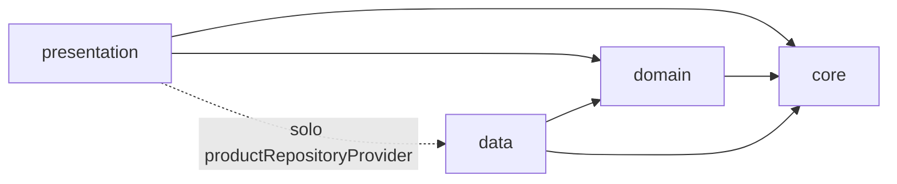
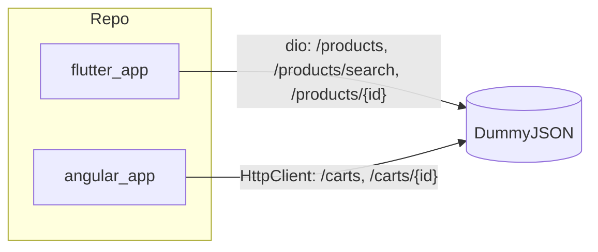
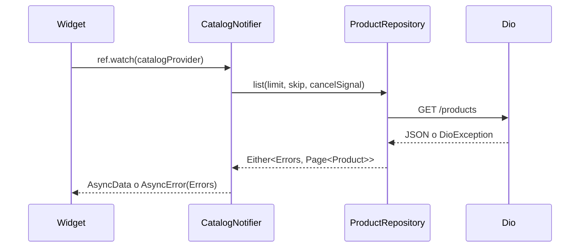
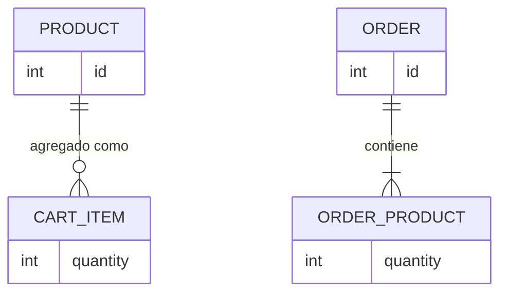

# Architecture Spine — gmariposa_practice

## Design Paradigm

Dos apps independientes, sin código compartido. Cada una con su propio paradigma:

- **Flutter:** capas por feature `data / domain / presentation` más `core/` transversal. `domain` es Dart puro. El estado es Riverpod con generador; el error viaja como `Either<Errors, T>` hasta el borde del notifier y de ahí como `AsyncError(Errors)`.
- **Angular:** componentes standalone en dos roles (contenedor y presentacional) sobre NgRx Store clásico (`actions → reducer → state → selectors`, con `effects` para la E/S).

Equivalencias entre apps (vocabulario de entrevista, no código compartido): `OrdersService` ≈ Repository · selector ≈ provider · componente presentacional ≈ widget sin estado.

## Invariants & Rules

### AD-1 — Dos apps independientes [ADOPTED]

- **Binds:** FR-21, NFR-8
- **Prevents:** convenciones, dependencias o scripts compartidos entre `flutter_app/` y `angular_app/`.
- **Rule:** cada carpeta tiene su propio lint, test, lockfile (commiteado) y comandos. Ninguna importa de la otra. El PDF de la prueba queda fuera del repo.

### AD-2 — Regla de dependencias de Flutter [ADOPTED]

- **Binds:** FR-10, T-1
- **Prevents:** `presentation` hablando con `dio`; ciclos entre features y `core`; dos dueños de un modelo.
- **Rule:**
  - El sentido de importación es el del diagrama. `domain` solo importa `core/errors`, `fpdart`, `freezed_annotation` y `json_annotation`. `core/` nunca importa features. Ni `domain` ni `presentation` importan `dio`.
  - Entre features solo se permiten estos imports: `catalog/presentation` y `product_detail/presentation` → `products`; `product_detail/presentation` → `cart/presentation` (botón agregar); `cart/domain` → `products/domain`. `products` no importa ninguna otra feature.
  - El cumplimiento se revisa con `very_good_analysis` y en el code review de cada story.



### AD-3 — Un solo dueño de cada pieza de infraestructura y de cada modelo [ADOPTED]

- **Binds:** FR-10, FR-11, T-4
- **Prevents:** dos clientes HTTP, dos modelos `Product`, dos formas de mapear errores.
- **Rule:**
  - `core/` crea el único `Dio` (URL base de DummyJSON como constante, sin `envied`; `connectTimeout` y `receiveTimeout` de 10 s como constantes).
  - `data/` implementa el Repository y es el único lugar que captura `DioException`: timeouts y fallos de conexión → `NetworkException`; respuesta no exitosa → `ServerException(status)`; JSON inválido → `ParseException`; una petición cancelada no es un error.
  - `core/` expone un `CancelSignal` propio, y los métodos del Repository lo aceptan opcional. Así `presentation` cancela sin importar `dio`.
  - `features/products/{data,domain}` es el único dueño de `Product`, `Page<Product>` y `ProductRepository`. `catalog` y `product_detail` solo tienen `presentation`.
  - `productRepositoryProvider` se declara en `products/data/` y es la única importación de `data` permitida desde `presentation`.
  - Los modelos `freezed` con `fromJson` viven en `domain/` (sin DTO aparte). Un campo requerido ausente o de tipo erróneo produce `ParseException`.

### AD-4 — Capa de errores de Flutter: `Either` en el contrato, excepción en el borde [ADOPTED]

- **Binds:** FR-2, FR-5, FR-12, T-1, T-2, T-3
- **Prevents:** excepciones crudas de `dio` en la UI; `fold` repetido en cada notifier; mensajes armados en widgets; una acción que borra la lista al fallar.
- **Rule:**
  - `Errors` y `BaseException(message, code)` están en `core/errors/`, con una subclase por falla (`NetworkException`, `ServerException`, `ParseException`).
  - Los métodos del Repository devuelven `Future<Either<Errors, T>>` (`fpdart`).
  - La **carga inicial** desenvuelve con `getOrThrow()` (extensión propia en `core`, porque `fpdart` no la trae) dentro de `build()`. Riverpod la guarda como `AsyncError(Errors)`.
  - Las acciones que fallan **sin reemplazar el estado** (`loadMore`) hacen `fold` y escriben el error en el campo `loadMore` del estado de datos (un `AsyncValue<void>`). No usan `AsyncValue.guard`.
  - Solo se lanza en providers asíncronos, nunca en síncronos.
  - La UI deriva el mensaje del `Errors`. Un error que no sea `Errors` se muestra como mensaje genérico.

### AD-5 — Estado de Flutter solo con Riverpod [ADOPTED]

- **Binds:** NFR-1, NFR-5
- **Prevents:** `setState` o `flutter_hooks` para estado de negocio; reintento oculto que rompe "Reintentar"; estado que se reinicia al navegar.
- **Rule:**
  - `riverpod_generator` en todos los providers. `ref.watch` en `build`, `ref.read` solo en callbacks. Estado inmutable (cada cambio crea una nueva colección).
  - El reintento automático de Riverpod 3 se desactiva: `ProviderScope(retry: (_, __) => null)` y el mismo `retry` en cada `ProviderContainer` de test.
  - Los providers son autoDispose por defecto. Llevan `keepAlive: true` el del Cart, `searchTerm`, el de `Dio` y el del Repository.
  - Los notifiers no navegan ni muestran UI; la UI reacciona con `ref.listen`.

### AD-6 — Catalog, búsqueda y paginación son un solo mecanismo [ADOPTED]

- **Binds:** FR-1, FR-2, FR-3, DF-1
- **Prevents:** dos notifiers con lógica de estados duplicada; una respuesta tardía que pisa la lista; un Catalog colgado sin consulta inicial; "Reintentar" ambiguo.
- **Rule:**
  - `searchTerm` es un `Notifier<String>` síncrono con `keepAlive` (estado de UI, sin red).
  - `debouncedTerm` es un `StreamProvider` con `stream_transform`. Emite `''` al inicio, sin debounce. Un término vacío (tras `trim`) se emite de inmediato, y uno no vacío tras 400 ms sin cambios.
  - `catalogProvider` observa `debouncedTerm` con `select((a) => a.value ?? '')` y elige listar o buscar. Su estado es `items`, `total` y `loadMore`, un `AsyncValue<void>` (`AsyncData(null)` ocioso, `AsyncLoading` cargando, `AsyncError(Errors)` fallido). No existen banderas booleanas sueltas ni un tipo wrapper propio.
  - Descarte de respuestas tardías: el notifier lleva un contador de época que se incrementa en cada `build()`. Toda respuesta (inicial o de `loadMore`) compara su época al volver y se descarta si cambió. La petición pendiente se corta con el `CancelSignal` en `ref.onDispose`.
  - `loadMore()` usa `skip = items.length`; hay más páginas mientras `items.length < total`; se ignora si `loadMore.isLoading`; conserva la lista y, si falla, deja `loadMore` en `AsyncError` con un reintento al final. El pie de la lista lee `loadMore.when(...)`.
  - "Reintentar" de la carga inicial es siempre `ref.invalidate(catalogProvider)`. El de `loadMore` vuelve a llamar a `loadMore()`.
  - El gatillo de `loadMore()` es el `ScrollController` de la UI.

### AD-7 — Cart sin red y con lógica pura [ADOPTED]

- **Binds:** FR-6, FR-7, FR-8, FR-9
- **Prevents:** lógica de negocio en widgets; un contador distinto del total; un Cart que se vacía al navegar; dos definiciones de `CartItem`.
- **Rule:**
  - `CartItem { Product product, int quantity }` se define una sola vez en `cart/domain/`. Agregar, cambiar cantidad, quitar y total son funciones puras en ese mismo `domain/`. Una cantidad nunca baja de 1 al disminuir.
  - El `Notifier` del Cart vive en `presentation/`, con `keepAlive`, y es el único dueño del estado.
  - `cartCountProvider` se deriva de ese estado (suma de unidades). El total es la suma de precio × cantidad en `double`, y solo se redondea al mostrarlo, con dos decimales y sin símbolo de moneda.
  - El detalle del Product siempre consulta por `id`, sin reutilizar datos del Catalog.

### AD-8 — Navegación por `context`, rutas autosuficientes [ADOPTED]

- **Binds:** FR-4, FR-5, UJ-1
- **Prevents:** un router que dependa de estado; rutas que fallan al entrar por URL; un router recreado en cada `build`.
- **Rule:**
  - Existe un único `GoRouter`, creado una sola vez en el shell de la app (`MaterialApp.router`), sin provider. Los widgets navegan con `context`.
  - Del Catalog al detalle y al Cart se usa `context.push`, de modo que el Catalog sigue en la pila.
  - Rutas: `/`, `/product/:id`, `/cart`. El `id` se parsea a `int` una sola vez en la ruta, y uno inválido va a una pantalla de error. Cada ruta funciona con solo la URL.
  - El botón "atrás" del detalle usa `context.canPop() ? pop() : go('/')`.
  - El router y los providers viven en `presentation/` (el router es transversal, en el `presentation/` de nivel superior).

### AD-9 — Deep link verificable en Android [ADOPTED]

- **Binds:** AD-8
- **Prevents:** declarar deep link sin haberlo probado.
- **Rule:** `AndroidManifest.xml` declara un `intent-filter` con acción `VIEW`, categorías `DEFAULT` y `BROWSABLE`, y datos `scheme="gmariposa"` y `host="app"`. Se verifica en un emulador con `adb shell am start -a android.intent.action.VIEW -d "gmariposa://app/product/5"`. El resultado entra al README.

### AD-10 — Angular: contenedor, presentacional y Store clásico [ADOPTED]

- **Binds:** FR-13, FR-14, FR-15, FR-16, FR-17, NFR-6
- **Prevents:** componentes que llaman a `HttpClient`; dos dueños de un Order; suscripciones sueltas.
- **Rule:**
  - Standalone, TypeScript `strict`, zoneless (el default de la versión vigente).
  - `OrdersPageComponent` (contenedor) lee selectores y despacha acciones. `OrderCardComponent` (presentacional) recibe `input()`, emite `output()`, usa `OnPush`, no inyecta servicios ni navega.
  - Ningún componente importa `HttpClient`. Solo `OrdersService` lo usa, y solo los `effects` llaman a `OrdersService`.
  - El filtro por total mínimo (`>=` sobre `total`): un `FormControl` es la entrada de la UI y despacha `setMinTotal` al Store, que es el dueño del estado (`minTotal`). La lista visible es un selector sobre los datos cargados, sin nueva petición. El flujo va siempre del `FormControl` al Store, nunca al revés.
  - Los datos se consumen con `async` pipe o `toSignal` sobre selectores, y no queda ningún `subscribe()` sin limpieza.
  - Cada story corre `ng test` y `ng build`.

### AD-11 — Angular: forma del estado y rutas autosuficientes [ADOPTED]

- **Binds:** FR-16, DA-1
- **Prevents:** un Order en dos lugares; un estado de carga compartido entre lista y detalle; efectos registrados dos veces.
- **Rule:**
  - Los Orders viven en un único mapa por `id`. La lista y el detalle lo alimentan siempre por `upsert`, nunca reemplazan el mapa. Un Order está "cargado" si `entities[id]` existe. La lista se ordena por `id`.
  - El estado de carga y error de la lista (`listStatus`, `listError`) es independiente del del detalle (`byIdStatus` por `id`).
  - `/orders/:id` es lazy (`loadComponent`). El `id` se parsea a `number` una sola vez, en la ruta. Si el Order no está cargado, despacha `loadOrder(id)`.
  - Los effects usan `exhaustMap` para la lista y `mergeMap` para el detalle. El Store y los effects se registran una sola vez, en la configuración raíz, y no en las rutas lazy.
  - El estado y las acciones guardan solo valores planos: `status` y un `ErrorInfo { message, code }`, con `code` de un tipo cerrado. Una única función `toErrorInfo(errors)` hace la conversión.

### AD-12 — Errores de Angular: `Result` y `Schema` de `effect` en el borde [ADOPTED]

- **Binds:** FR-12 (paralelo), FR-13, FR-15
- **Prevents:** `HttpErrorResponse` o datos sin validar llegando al Store; la UI armando mensajes; dos definiciones del tipo Order; usar el runtime de `effect` donde no hace falta.
- **Rule:**
  - `Errors` y `BaseException(message, code)` en TypeScript, con las mismas subclases que en Flutter.
  - Solo se usan los módulos `Schema` y `Result` de `effect`; no se usa el runtime `Effect` (fibers, layers, `Effect.gen`).
  - `OrdersService` devuelve `Observable<Result<T, Errors>>`. Valida la respuesta con `Schema.decodeUnknownResult` y mapea los fallos de validación a `ParseException`.
  - El tipo `Order` se obtiene de `Schema.Schema.Type` del esquema (única fuente). `discountedTotal` es opcional.
  - El effect de NgRx hace `match` sobre el `Result` y despacha la acción de éxito o de fallo. El mensaje que ve el Usuario viene del `ErrorInfo`.
  - La story de Angular confirma los nombres de la API contra la documentación de la v4 antes de escribir código (en la v3 el tipo se llamaba `Either`).

### AD-13 — Pruebas y puerta de calidad por story [ADOPTED]

- **Binds:** NFR-2, NFR-3, NFR-4, FR-21
- **Prevents:** entregar una story sin las verificaciones de la prueba; conflictos de archivos generados entre ramas.
- **Rule:**
  - **Flutter:** `mocktail` para el Repository falso, y `ProviderContainer` u `overrides` con el reintento desactivado. Mínimo 3 pruebas unitarias y 1 de widget. Cada story corre `dart format`, `flutter analyze` (`very_good_analysis`, sin warnings) y `flutter test`.
  - **Angular:** Vitest, con `HttpTestingController` para el servicio. Mínimo 2 pruebas.
  - Los archivos generados (`*.g.dart`, `*.freezed.dart`) se commitean y se regeneran antes de cada commit. Ante un conflicto en ellos se regeneran, nunca se fusionan a mano.
  - Una rama por story (`<tipo>/<epic>-<story>-<slug>`), Conventional Commits en inglés con alcance `flutter`, `angular`, `docs` o `repo`.

### AD-14 — Entorno, plataformas y toolchain [ADOPTED]

- **Binds:** NFR-8
- **Prevents:** una entrega que no compila en un clon limpio; una app que funciona en debug y no en release.
- **Rule:**
  - Plataforma objetivo de Flutter: Android (emulador). No hay despliegue ni entornos: ambas apps corren en local contra DummyJSON.
  - `AndroidManifest.xml` principal declara el permiso `INTERNET`, y no solo el de debug.
  - Paso 0 del scaffold de Flutter: `flutter upgrade` hasta tener Dart ≥ 3.13. El spine cita la versión de Flutter y de Dart resultantes en el Stack.
  - Angular exige TypeScript `~6.0`.

### AD-15 — Aplicabilidad de `constitution-ddd` v1.2.0 [ADOPTED]

- **Binds:** all
- **Prevents:** aplicar a ciegas una guía pensada para backends; o desviarse de ella sin documentarlo.
- **Rule:**
  - La constitución (`extended-sdd/templates/constitution-ddd.md`) se adopta como referencia, con las desviaciones de esta tabla. Su sección 1 define al cliente como capa delgada sin lógica de dominio.
  - **Aplican:** `error-handling` (cubierta por AD-4 y AD-12), `no-unsafe-type-escapes` (ni `as` ni `!` para forzar tipos; se estrecha con `is`, `switch` o guardas) y `no-dynamic-imports`. Excepción documentada: `loadComponent` de las rutas lazy de Angular es code-splitting de cliente.
  - **No aplican (no hay backend propio):** `module-structure` con use cases, `service-layer`, `repository` como DAO, `mapper`, `error-envelope` (T-1), `shared-module`, `auth`, `audit` y `transactional-state`.
  - **Value Objects: ninguno.** Los modelos son `freezed` (Flutter) o tipos inferidos del esquema (Angular), con primitivos. La invariante de cantidad mínima 1 del Cart es una función pura de `cart/domain/` (AD-7).

## Consistency Conventions

| Concern | Convention |
| --- | --- |
| Naming | Código e identificadores en inglés; glosario del PRD (Product, Catalog, Cart, Cart item, Order, Repository, Errors) sin sinónimos. Flutter: `snake_case` en archivos. Angular: `kebab-case` con sufijos `*.component.ts`, `*.service.ts`. |
| Data & formats | `id` de Product y de Order: `int`. Precios: `double`, mostrados con dos decimales y sin símbolo. Paginación: `limit` (20) y `skip` en todo listado de Products; el listado devuelve también `total`. Orders: `GET /carts?limit=0`. |
| State & cross-cutting | Flutter: Riverpod, estado inmutable. Angular: Store clásico, estado serializable. Sin `print` de depuración ni `any` sin justificar. La URL base de DummyJSON es una constante por app. |
| UI | Los widgets y componentes siguen `DESIGN.md` y `EXPERIENCE.md` del UX, y cada story de UI cita su pantalla en `stitch-index.md`. |

## Stack

| Name | Version |
| --- | --- |
| Flutter / Dart | stable tras `flutter upgrade`, Dart ≥ 3.13 (hoy 3.44.1 / 3.12.1; una revisión reportó 3.47.6 / 3.13.5, confirmar con `flutter --version`) |
| flutter_riverpod · riverpod_annotation · riverpod_generator | 3.4.3 · 4.0.7 · 4.0.9 |
| freezed · freezed_annotation · json_serializable · build_runner | 4.0.2 · 3.1.0 · 6.14.1 · 2.16.1 |
| fpdart · dio · go_router | 1.2.0 · 5.11.1 · 18.0.2 |
| stream_transform · mocktail · very_good_analysis | 2.1.2 · 1.0.5 · 11.0.0 |
| Angular (CLI y core) · TypeScript · Node | 22.2.1 · ~6.0 · 24.16 |
| @ngrx/store · @ngrx/effects · @ngrx/store-devtools | 22.0.1 |
| effect · Vitest | 4.0.1 · 5.0.3 |

## Structural Seed







```text
flutter_app/lib/
  core/            # Dio, CancelSignal, errors/, theme, extensiones
  presentation/    # shell: app, router, tema aplicado
  features/
    products/{data,domain}      # Product, Page, ProductRepository (único dueño)
    catalog/presentation
    product_detail/presentation
    cart/{domain,presentation}  # CartItem y lógica pura en domain
angular_app/src/app/
  core/            # errors, tipos compartidos, OrdersService
  features/orders/ # components/, store/ (actions, reducer, effects, selectors)
```

## Capability → Architecture Map

| Capability / Area | Lives in | Governed by |
| --- | --- | --- |
| FR-1, FR-2 Catalog | features/catalog, features/products | AD-2, AD-3, AD-4, AD-6 |
| FR-3 Búsqueda con debounce | features/catalog/presentation | AD-5, AD-6 |
| FR-4, FR-5 Detalle | features/product_detail | AD-4, AD-8 |
| FR-6..FR-9 Cart | features/cart | AD-5, AD-7 |
| FR-10..FR-12 Datos y errores | core/, features/products | AD-2, AD-3, AD-4 |
| FR-13..FR-17 Panel de Orders | angular_app features/orders | AD-10, AD-11, AD-12 |
| FR-18, FR-19 Documentos | RESPUESTAS.md | PRD §4.7 (fuera del spine) |
| FR-20, FR-21 README y repo | raíz | AD-1, AD-13, AD-14 |
| NFR-1..NFR-6, NFR-8 | ambas apps | AD-5, AD-10, AD-13, AD-14 |

## Deferred

| Tema | Por qué puede esperar | Condición de revisión |
| --- | --- | --- |
| Storybook para Angular | No está en el PRD; añade `zone.js` como peer del paquete | Obligatorios y DA cerrados y hay tiempo |
| Filtro por categoría (DF-2), persistencia del Cart (DF-3), tema (DF-6) | El contrato de Repository y el estado ya los admiten | Obligatorios y DF-1 cerrados |
| Prueba de integración (B-1) y GitHub Action (B-2) | Bonus: se consideran si da tiempo, en el orden del PRD (§6.2) y solo con los obligatorios cerrados | Todo lo anterior cerrado, con `analyze` limpio |
| Rutas tipadas (`go_router_builder`) | Otro generador de código | Si aparecen más de tres rutas con parámetros |
| `httpResource` en Angular | Se mantiene el servicio con `HttpClient` que pide el PRD | Mención en la entrevista |
| Compatibilidad exacta de los generadores con `build_runner` | Por lectura de rangos se solapan, pero falta un `pub get` real | Primer `build_runner` de la story de Flutter |
| Zoneless por defecto y Vitest como runner de `ng new` | Se ven al generar el proyecto | Story de scaffold de Angular |
